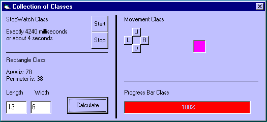

<div align="center">

## Programming with Class


</div>

### Description

Using classes for OOP in VB. These are a few simple examples of development and implementation of classes in VB. Classes allow for optimal reusability which is an important issue when developing programs in any language. Hopefully this example will help point you in the right direction if you wish to learn about programming with classes. Feedback is appreciated.
 
### More Info
 
This example is geared toward the user who is not familiar with or only slightly familiar with classes. This is NOT a tutorial. Simply an example of classes the way I make them.


<span>             |<span>
---                |---
**Submitted On**   |2002-07-07 14:29:12
**By**             |[lostcauz](https://github.com/Planet-Source-Code/PSCIndex/blob/master/ByAuthor/lostcauz.md)
**Level**          |Intermediate
**User Rating**    |5.0 (45 globes from 9 users)
**Compatibility**  |VB 6\.0
**Category**       |[Object Oriented Programming \(OOP\)](https://github.com/Planet-Source-Code/PSCIndex/blob/master/ByCategory/object-oriented-programming-oop__1-47.md)
**World**          |[Visual Basic](https://github.com/Planet-Source-Code/PSCIndex/blob/master/ByWorld/visual-basic.md)
**Archive File**   |[Programmin103195772002\.zip](https://github.com/Planet-Source-Code/lostcauz-programming-with-class__1-36688/archive/master.zip)

### API Declarations

```
Private Declare Function _
GetTickCount Lib "kernel32" () As Long
```


